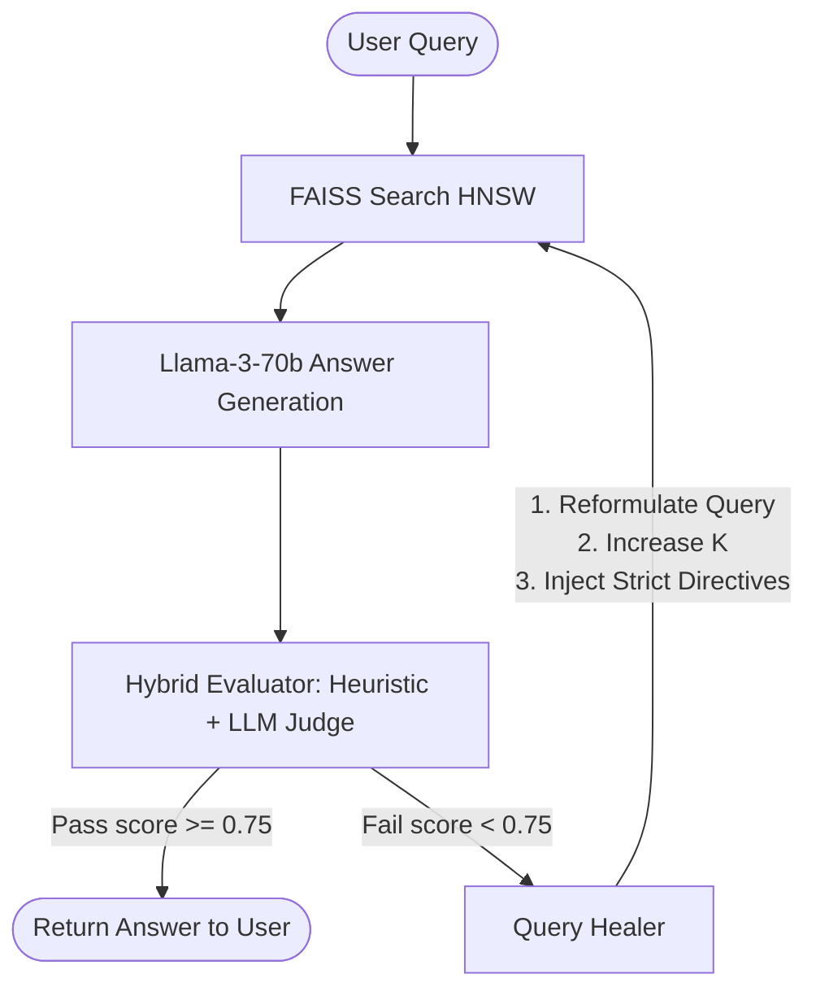

# Self-Healing RAG Pipeline

A production-grade Retrieval-Augmented Generation (RAG) pipeline that evaluates its own responses and automatically repairs (heals) bad ones. 

Unlike standard RAG architectures that silently generate answers from poor retrievals or hallucinate facts, this pipeline uses a closed-loop feedback system (Hybrid Evaluation + LLM query healing) to catch failures and retry with optimized strategies.

---

## Architecture Overview



### Components:
1. **Ingestion (`ingestion/loader.py`, `ingestion/chunker.py`)**: Supports PDF (PyMuPDF), DOCX, TXT, and Markdown files. Uses structure-aware section splitting and falls back to recursive character chunking (512-character chunks, 100-character overlap). Extracts rich metadata (filename, page, type, timestamp).
2. **Retrieval (`retrieval/embedder.py`, `retrieval/vector_store.py`)**: Uses the `all-mpnet-base-v2` SentenceTransformer to generate dense vectors. Performs fast, near-exact search using a local FAISS `IndexHNSWFlat` index.
3. **Generation (`generation/generator.py`)**: Calls Groq's `llama3-70b-8192` model at `temp=0.3`. Incorporates strict system guidelines and a structured context presentation containing source metadata and relevance scores.
4. **Evaluation (`evaluation/evaluator.py`)**: 
   - **Heuristics**: Fast-fails on low FAISS similarity scores, answer length anomalies, or refusal statements (e.g., "I don't have enough information").
   - **LLM-as-a-Judge**: Evaluates four dimensions: *Context Relevance*, *Faithfulness* (hallucination check), *Answer Relevance*, and *Answer Completeness*.
5. **Healing (`healing/healer.py`)**: Triggers up to 3 retries based on failure mode:
   - *Bad retrieval / Insufficient context*: Reformulates search keywords.
   - *Incomplete*: Increases retrieval count $K$ and targets missing query details.
   - *Hallucination*: Reformulates query + generates specific anti-hallucination prompt directives.

---

## Setup Instructions

### 1. Requirements
Ensure you have Python 3.10+ installed.

Install the dependencies:
```bash
pip install -r requirements.txt
```

### 2. Environment Configuration
Create a `.env` file in the root directory:
```env
GROQ_API_KEY=your_groq_api_key_here
```

---

## Running the API

Start the FastAPI application with Uvicorn:
```bash
uvicorn api.main:app --reload
```
The documentation will be available at: [http://127.0.0.1:8000/docs](http://127.0.0.1:8000/docs)

### API Endpoints

#### 1. Ingest Documents (`POST /ingest`)
Scans the `data/` directory or accepts form files to upload and indexes them.
- **Form Data (Optional)**: `files` (list of documents)
- **Response**:
  ```json
  {
    "message": "Ingestion completed successfully.",
    "total_chunks_indexed": 42,
    "data_directory": "/path/to/data"
  }
  ```

#### 2. Query Pipeline (`POST /query`)
Executes the self-healing loop.
- **Request Body**:
  ```json
  {
    "query": "How many days of medical leave do I get?"
  }
  ```
- **Response**:
  Returns the final answer along with a full step-by-step trace showing every healing loop execution, retrieval keywords, and evaluation scores.

#### 3. Index Status (`GET /status`)
Returns the list of indexed files and total vector counts in FAISS.

#### 4. Reset Index (`POST /reset`)
Clears all vector database indexes and chunk metadata.
